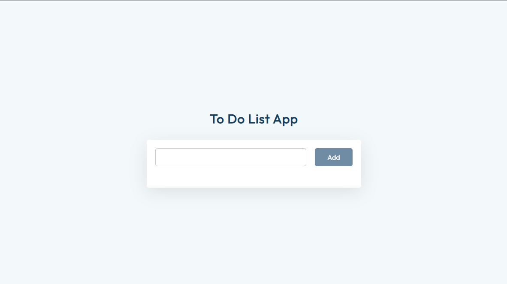

# To-Do-List-App
I made a to do list using HTML CSS and JAVASCRIPT

### Screenshot

### Links

- Solution URL: [https://github.com/Teke111/To-Do-List-App]
- Live Site URL: [https://teke111.github.io/To-Do-List-App/]

### Built with

- Semantic HTML5 markup
- CSS custom properties
- Javscript
